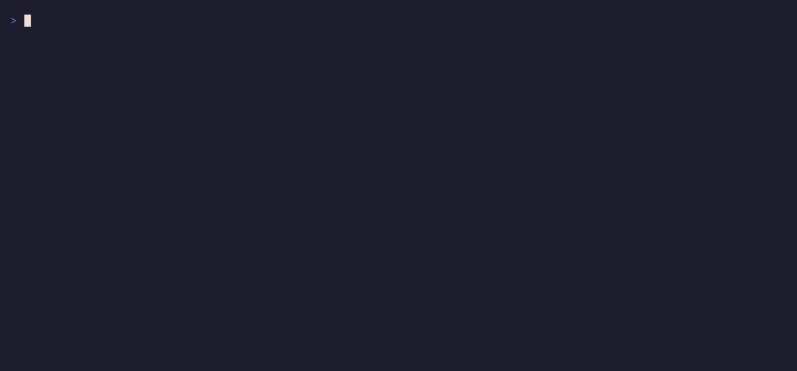

# PDD — Parity-Driven Development

**A framework for reliable legacy refactor, rewrite, and port — with tracked behavioral parity.**

PDD turns "does the new system still behave like the old one?" from a gut feeling into
**objective, tracked evidence**. Every behavior of the reference (legacy) system becomes a
finding you can investigate, fix, prove, and gate through QA before it ever reaches `main`.

The framework is built on eight principles: **forced discipline / gates**, **state
externalized in files** (`.audit/` is the source of truth, not the model's context),
**small composable commands**, **objective evidence over opinion**, **a human at the gate
of every irreversible action**, **fast observable feedback**, **idempotent state-aware
commands**, and **progressive disclosure** (the cycle teaches itself).

> **Inviolable rule:** the AI never *authors* commits. `push` / `gh pr create` happen only
> after an explicit human **"yes"** in the same session. **Merge is 100% human** and only
> after QA approves.

---

> **New to PDD?** The [**Quickstart**](QUICKSTART.md) walks you from zero to your first verified
> finding, one command at a time, with a real worked example.

## Installation

PDD ships as a single-plugin marketplace. Install it into a project:

```
/plugin marketplace add blpsoares/parity-driven-development
claude plugin install pdd@parity-driven-development --scope project
```

> **PDD only makes sense installed per-project** (`--scope project`). Its whole job is to
> track the parity of *one* migration against *one* reference system, and it stores that
> state in the project's `.audit/` directory. A global install has nothing to track.

**Coming from the old home?** If you installed PDD via `pdd@blpsoares-my-claude`, reinstall
it from the new marketplace above. PDD moved to its own dedicated repo.

---

## The cycle (multi-phase QA)

Run these skills one at a time. Each is gated: it refuses to advance on insufficient input.

```
/audit-bootstrap            once — captures QA environments, coverage baseline, thresholds
        │
        ▼
/audit-new <desc>           → finding NNN (+ initial confidence score, + coverage entry)
        │                      optionally isolates the work in a dedicated git worktree
        ▼
/audit-investigate NNN      → root cause
        │
        ▼
/audit-resolve NNN          → fix + characterization test + parity evidence
        │                      creates branch audit/NNN · does NOT commit · coverage → resolved
        ▼
   (human commits)
        │
        ▼
/audit-compare NNN          → golden-master harness: runs both systems, produces objective diff
        │
        ▼
/audit-qa NNN local         → QA on LOCALHOST, BEFORE the PR. Approval unblocks /audit-pr.
        │
        ▼
/audit-pr NNN               → assembles the PR dossier. BLOCKS unless qa-local is approved.
        │                      push + gh pr create ONLY after human "yes"
        ▼
   (deploy to dev / staging / prod)
        │
        ▼
/audit-qa NNN staging|prod  → QA on the deployed ENVIRONMENT, AFTER the PR. Records qa-<env>.
        │
        ├─ ✅ target-env QA approved + PR merged → coverage → verified (a HUMAN merges)
        └─ ❌ rejected  → follow-up finding on the SAME branch (pre-merge) or a new one (post-deploy)

/audit-status  ·  pdd board --watch     (at any moment)
```

**QA is multi-phase.** It runs **local** (localhost, *before* the PR — its approval is a blocking
precondition of `/audit-pr`) and per **deployment environment** (dev/staging/prod, *after* the
PR/deploy). Per-environment status is stored as `qa-<env>` on the finding. Coverage only becomes
`verified` when the **target environment** (`QA_TARGET_ENV`, default the last in the chain) is
approved **and** the PR is merged. **Merge is 100% human.**

### Worktree option

`/audit-new` asks whether to isolate a finding's work in a dedicated **git worktree**.

- **Yes** → creates worktree + branch `audit/NNN-<slug>` **inside the repo** and records
  `worktree: <path>` on the finding. `investigate` / `resolve` / `compare` / `pr` then operate
  **inside that worktree**. The base directory follows the harness:
  - **Claude Code** → `.claude/worktrees/audit-NNN-<slug>`
  - **Any other agent** → `.audit-worktrees/audit-NNN-<slug>`
  - The base is added to `.gitignore` so worktree contents are never committed.
- **No** → records `worktree: none`; the branch is created by `resolve` in the main checkout.

---

## Skills

| Skill | What it does |
|---|---|
| `/audit-bootstrap` | One-time interview. Captures reference-vs-new adapters, QA environments (`QA_ENVIRONMENTS` + `QA_TARGET_ENV`), preview/branch mode, seeds the coverage map, sets confidence thresholds. |
| `/audit-new <desc>` | Opens finding `NNN`, computes an initial confidence tier, adds a coverage entry, and asks the worktree-isolation question. |
| `/audit-investigate NNN` | Read-only root-cause investigation of the reference behavior. |
| `/audit-resolve NNN` | Fix + mandatory characterization test + machine-readable `evidence` block. Creates branch `audit/NNN`, does **not** commit. Blocks below `CONFIDENCE_MIN`. |
| `/audit-compare NNN` | **Golden-master harness.** Runs the same operation on both systems (CLI / DB / API / browser adapter) and emits an objective data-to-data diff (Tier 2 evidence). Read-only, confirms every query first. |
| `/audit-pr NNN` | Assembles the PR as an **evidence dossier** (symptom→cause→fix, tier, checks, characterization test, parity diff, paired screenshots, QA checklist). **Blocks unless `qa-local` is approved.** Pushes and opens the PR **only after an explicit human "yes."** |
| `/audit-qa NNN <env>` | Multi-phase QA. `local` runs on localhost **before** the PR (unblocks `/audit-pr`); `dev`/`staging`/`prod` run **after** the PR/deploy on that environment. Records `qa-<env>`. Coverage → `verified` only when the target env is approved **and** the PR is merged. |
| `/audit-status` | In-chat panel: parity-coverage %, confidence distribution, active tasks, suggested next actions. |

---

## Install in any agent

PDD's method (`.audit/`) and the `pdd` CLI are **harness-agnostic** — only the way each agent
registers slash commands differs. PDD is command-based (like `specify init`), not hook-based, so
installing just scaffolds the right command files.

**Easiest — via npm** (needs only Node ≥ 18; works with no Claude Code):

```bash
npx parity-driven-development init                 # interactive picker (specify-init style)
npx parity-driven-development init codex gemini    # or name the agents
```

**Or the shell installer** (needs `git` + [`bun`](https://bun.sh)):

```bash
curl -fsSL https://raw.githubusercontent.com/blpsoares/parity-driven-development/main/install.sh | bash -s -- <codex|cursor|copilot|gemini|all>
```

**Per agent** — expand your agent:

<details>
<summary><b>Claude Code</b> — native plugin</summary>

```bash
/plugin marketplace add blpsoares/parity-driven-development
claude plugin install pdd@parity-driven-development --scope project
```

Invoke with `/audit-bootstrap`, `/audit-new`, … Installs as a first-class plugin (skills + `pdd` CLI + the opt-in SessionStart tip).
</details>

<details>
<summary><b>Codex</b></summary>

```bash
curl -fsSL https://raw.githubusercontent.com/blpsoares/parity-driven-development/main/install.sh | bash -s -- codex
# or, if you have the CLI:  pdd adapt codex
```

Writes to **`~/.codex/prompts/audit-*.md`** (Codex only reads prompts from your home, not the repo). Invoke with `/audit-new`. Uses `$ARGUMENTS`.
</details>

<details>
<summary><b>Cursor</b></summary>

```bash
curl -fsSL https://raw.githubusercontent.com/blpsoares/parity-driven-development/main/install.sh | bash -s -- cursor
# or:  pdd adapt cursor        (add --global for ~/.cursor)
```

Writes to **`.cursor/commands/audit-*.md`** in the project (committable, shared with your team). Invoke with `/audit-new`.
</details>

<details>
<summary><b>GitHub Copilot</b> (VS Code / JetBrains)</summary>

```bash
curl -fsSL https://raw.githubusercontent.com/blpsoares/parity-driven-development/main/install.sh | bash -s -- copilot
# or:  pdd adapt copilot
```

Writes to **`.github/prompts/audit-*.prompt.md`**. Invoke with `/audit-new` in the Chat view. ⚠️ The Copilot **CLI** does not yet support user slash commands — IDEs only.
</details>

<details>
<summary><b>Gemini CLI</b></summary>

```bash
curl -fsSL https://raw.githubusercontent.com/blpsoares/parity-driven-development/main/install.sh | bash -s -- gemini
# or:  pdd adapt gemini         (add --global for ~/.gemini)
```

Writes to **`.gemini/commands/audit-*.toml`**. Invoke with `/audit-new`. Uses `{{args}}`. Run `/commands reload` after installing.
</details>

<details>
<summary><b>Antigravity / any other agent</b></summary>

Tell the agent to *fetch and follow* [`INSTALL.md`](INSTALL.md), or point it at [`AGENTS.md`](AGENTS.md)
+ the `skills/` directory — the SKILL.md files are self-contained instructions. Where a file says
`$ARGUMENTS`, that is where the user's arguments go.
</details>

## Updating

**How you'll know:**
- **In Claude Code:** a SessionStart hook checks for a newer version and, when one exists, the
  assistant proactively tells you, offers to summarize what's new (from the CHANGELOG), and offers to
  run the update for you — once per version, never nagging.
- **In Codex / Cursor / Copilot / Gemini** (no session hooks): installing PDD also drops an always-on
  rule (`.cursor/rules/pdd.mdc`, `.github/instructions/pdd.instructions.md`, or a marked block in
  `AGENTS.md` / `GEMINI.md`) that tells the agent to run `pdd check` when starting PDD work and offer
  `pdd update` if a new version exists — the same proactive flow, driven by the rule + the CLI. Skip
  it with `pdd init --no-rules`.
- **In the terminal:** the `pdd` dashboard shows a 🔔 notice (checked once a day, cached, offline-safe).
- On demand: `pdd check`. Opt out of all of it with `PDD_NO_UPDATE_CHECK=1`.

**How to update:**

| Installed via | Update command |
|---|---|
| **npm** | `npm i -g parity-driven-development@latest` (or just `npx parity-driven-development@latest …`) |
| Claude Code plugin | `claude plugin update pdd@parity-driven-development` (then `pdd init` to refresh other agents' commands) |
| `install.sh` / git clone | `pdd update` — pulls the latest and re-generates your agents' command files |
| Codex / Cursor / Copilot / Gemini | re-run `install.sh <harness>` (or `pdd update`) — the generated command files are static snapshots and don't auto-update |

## Confidence tiers

Every finding carries a confidence tier describing the **quality of its evidence**.

| Tier | Evidence | Label |
|---|---|---|
| **tier-0** | textual description only | 🔴 low |
| **tier-1** | paired screenshots (reference vs new) | 🟡 medium |
| **tier-2** | automated data-to-data diff (`/audit-compare`) | 🟠 high |
| **tier-3** | tier-2 **plus** a passing characterization test | 🟢 max |

The tier lives in the finding's frontmatter (`confidence`) and in the `evidence` block of
`resolution.md`. `audit-resolve` refuses to close a finding below `CONFIDENCE_MIN`
(default `tier-1`, `tier-2` recommended), set during bootstrap.

---

## The coverage map

`.audit/coverage.md` is a **machine-readable** table — the single view of *how much of the
legacy behavior is already verified, and at what confidence*. Seeded by `audit-bootstrap`,
moved to `finding-open` by `audit-new`, and to `verified` by `audit-resolve`.

```markdown
| Behavior / Area          | Reference case | Status        | Tier   | Finding |
|--------------------------|----------------|---------------|--------|---------|
| checkout: total          | order #123     | verified      | tier-3 | 007     |
| login: lock after 3 fails| test user      | finding-open  | tier-1 | 012     |
| export CSV               | —              | not-started   | —      | —       |
```

Status is one of `not-started` · `finding-open` · `verified`.
**Parity coverage %** = verified / total — the headline metric on the panel.

---

## The `pdd` CLI

An **optional** dependency-free terminal dashboard that renders the same state as `/audit-status`.
It runs on **Node** (via npm/npx — nothing else to install) or **Bun**. The whole PDD *method* needs
no runtime at all — this is just a nicer way to watch progress.



> The GIF above is generated from [`demo/pdd.tape`](demo/pdd.tape) with
> [VHS](https://github.com/charmbracelet/vhs) — reproducible, always matching the current UI.
> See [`demo/README.md`](demo/README.md) to regenerate it.

### Getting the `pdd` command

Easiest — via **npm** (needs only Node ≥ 18, which you almost certainly have):

```bash
npx parity-driven-development board     # zero-install, one-off
# or install it globally:
npm install -g parity-driven-development
```

Already using the **Claude Code plugin**? The CLI ships with it — install the stable wrapper once
(resolves the installed version dynamically, survives `claude plugin update`):

```bash
bash ~/.claude/plugins/cache/parity-driven-development/pdd/*/scripts/install-cli.sh
```

Then, from any project that ran `/audit-bootstrap`:

```
pdd                  # interactive, navigable dashboard (default) — ↑/↓ move, →/enter expand, ←/esc collapse, q quit
pdd tui              # same interactive dashboard, explicit
pdd board            # static ANSI snapshot (good for piping/CI)
pdd board --watch    # static auto-refresh whenever .audit/ changes (fs.watch)
pdd prune            # remove stale/orphaned activity records (from crashed sessions)
```

With no path argument, `pdd` walks up from the current directory to find `.audit`, so it
works from any subfolder of the project.

The interactive TUI shows a collapsible tree: **Coverage**, **Worktrees** (expand a worktree
to see its branch, full path and findings), **Findings** grouped by lifecycle (open /
in-progress / done, each listing the finding ids), and **Active now** (live executions across
agents and worktrees). It refreshes live as `.audit/` changes.

It reads `board.md`, the findings' frontmatter, `coverage.md`, and the `evidence` blocks of
the resolutions. The CLI is optional — `/audit-status` covers the same ground in chat if
Bun isn't available.

---

## Generated `.audit/` structure

PDD keeps all state in the project under `.audit/` — it survives across sessions and devs.

```
.audit/
├── BOOTSTRAP.md            reference/new adapters, preview mode, coverage baseline, thresholds
├── board.md               tasks and cross-finding state
├── coverage.md            the parity coverage map
├── findings/NNN-<slug>/
│   ├── README.md          finding frontmatter (id, title, slug, area, severity,
│   │                      status, discovered-at/by, confidence, worktree)
│   ├── investigation.md   root cause
│   ├── resolution.md      fix + machine-readable `evidence` block + PR URL
│   └── refs/              parity-<date>.diff, parity-reference.png, parity-new.png
└── resolved/NNN-<slug>/   findings that shipped
```

The `evidence` block inside `resolution.md`:

```yaml
evidence:
  confidence: tier-3
  parity_diff: refs/parity-2026-07-01.diff
  characterization_test: tests/audit/007_checkout.test.ts
  screenshots: [refs/parity-reference.png, refs/parity-new.png]
  checks: { check: pass, test: pass }
  pr_url: https://github.com/org/repo/pull/42
```

---

## Language

The framework files are written in **English** because PDD is meant to be shared. But
language ≠ behavior: every skill instructs the AI to **interact with the dev in their
working language** — the example phrases in the skills are templates, not literal scripts.

---

## License

See the repository for license details.
